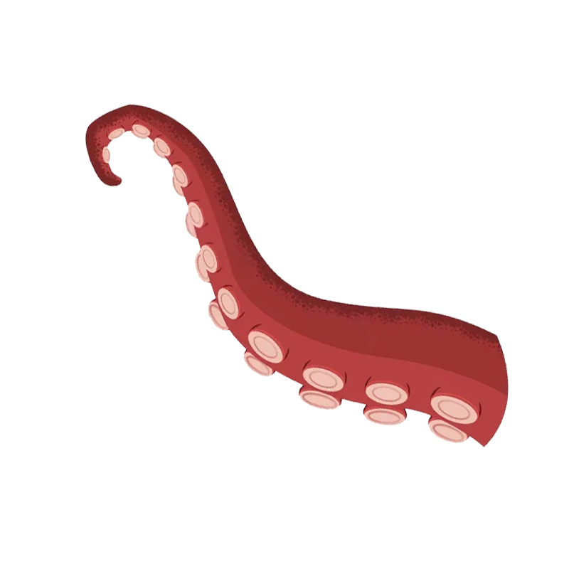
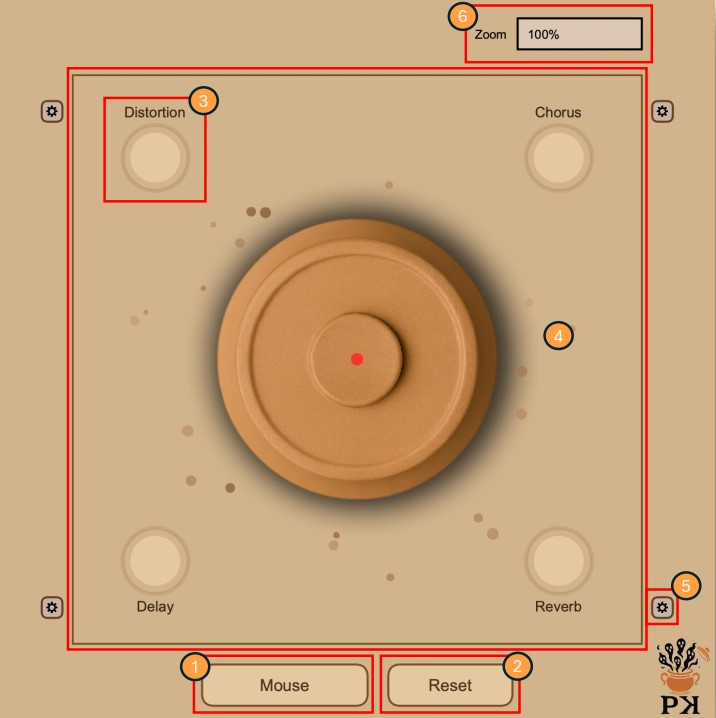
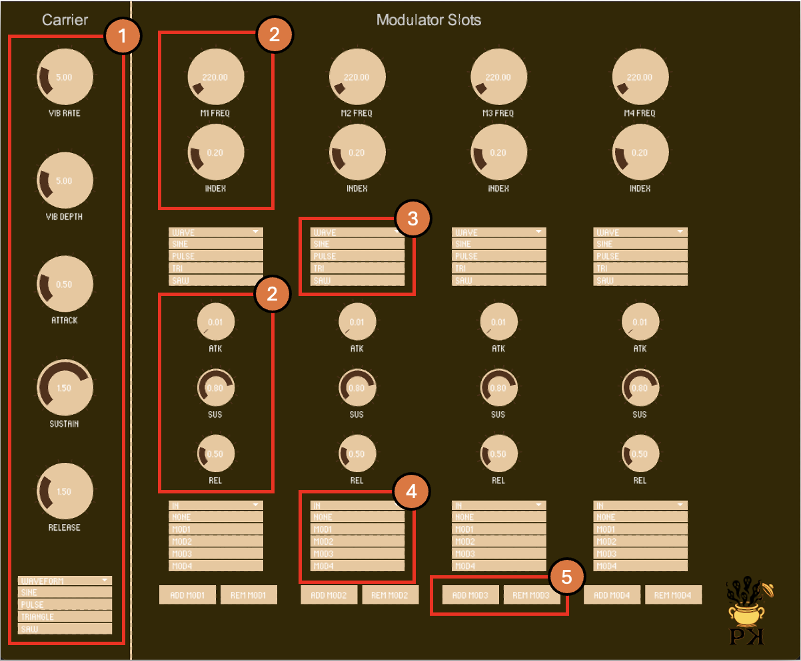
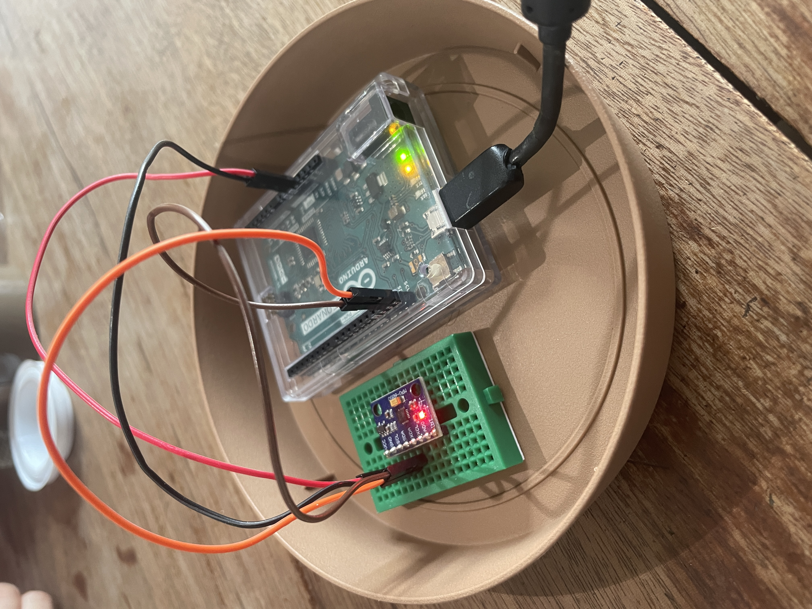

<h1 style="text-align: center; font-size: 2em;">
  
    
    PANDORA’S KNIGHTS – CMLS PROJECT
  
</h1>

## Contents
- [1 Introduction](#1-introduction)
  - [1.1 History Behind](#11-history-behind)
  - [1.2 Project Overview](#12-project-overview)
- [2 Modules](#2-modules)
  - [2.1 JUCE](#21-juce)
  - [2.2 SuperCollider](#22-supercollider)
  - [2.3 Processing](#23-processing)
- [3 Human-Computer Interaction](#30-human-computer-interaction)
  - [3.1 Arduino & MPU-6050 Integration](#31-arduino--mpu-6050-integration)
  - [3.2 Wiring](#32-wiring)
- [4 Pandora’s Suite Overall Pipeline](#40-pandoras-suite-overall-pipeline)

## 1 Introduction
Welcome to the GitHub repository of **Pandora’s Suite**, our final project for the course *Computer Music - Languages and Systems*.  
This collaborative effort was achieved by the Pandora's Knights group, composed by [Alessandro Mancuso](https://github.com/AleMancusoPOLI), [Andrea Antognetti](https://github.com/Andrea-Antognetti), [Mario Aucelli](https://github.com/riotunes) and [Matteo Di Giovanni](https://github.com/matteodigii).  

Here you can find our [presentation](https://drive.google.com/drive/folders/12aRB3pkQVNseDgiN3Q7Tfj5GtN5k6NjT?usp=share_link) for the final examination and a [demo video](https://drive.google.com/drive/folders/12aRB3pkQVNseDgiN3Q7Tfj5GtN5k6NjT?usp=share_link) of the project.

---

### 1.1 History Behind
Have you ever heard of the myth of Pandora’s box? If not, today’s your lucky day! 

The story, found in Hesiod’s poem *Works and Days*, tells of a young woman named Pandora who, driven by curiosity, opens a container entrusted to her and her husband, unleashing countless curses and troubles upon mankind.

  

That’s where our inspiration came from: why not create a **Computer Music System** based on this myth?

---

### 1.2 Project Overview
Once this vision became clear, it was just a matter of translating what **Greek mythology** had taught us into engineering.  
The first step was to define what the **“box”** would represent for us, and what kind of sounds we wanted to produce.

We decided on:
- A **multi-effects unit** controllable in a unique way  
- A **synthesizer** that emulates the sound of flutes – strongly connected to the idea of wind and air

---

## 2 MODULES
The project is subdivided into three main modules, using three different frameworks:

### 2.1 JUCE
We chose to implement the multi-effects unit using the **JUCE** framework because of its flexibility, customizability, and the ability to generate a ready-to-use **VST3 plugin** for integration with the SuperCollider component.

JUCE’s object-oriented nature also gave us greater control over processing blocks and parameter customization.

We developed a chain of four effects, in the following order:

-  **Distortion**
-  **Chorus**
-  **Delay**
-  **Reverb**

#### 🔊 Effect Details
- **Distortion**: Achieved through waveshaping using the `tanh` (hyperbolic tangent) function, combined with filtering. Specifically, a high-pass filter with a 1 kHz cutoff was applied to reduce excessive low-end and emphasize the harmonics that contribute most to the distortion character.
- **Delay**: Modeled by emulating an analog delay, using different pointers to read and write data on the audio buffer. More in detail, a sample-by-sample all-pass interpolation was applied, together with JUCE’s SmoothedValue objects, to obtain an effect without any glitches or artifacts. In addition, the analog-inspired implementation allows an interesting pitch modulation effect as we modify the time parameter of the delay.
- **Chorus & Reverb**: Implemented using the JUCE DSP module, which offers high-quality effects with a wide range of adjustable parameters. This was particularly useful for the reverb, as it allowed us to avoid working with impulse responses (IR), which would not have supported custom or licensed Irs.
- **Mixer Class**: Created created in order to achieve dry-wet mixing of the signal for the Distortion and Delay effects (JUCE DSP modules have a Mix parameter by default). The role of this class is to expose the methods to save the dry signal inside a buffer (to be called before applying the effect), and another method to merge it with the signal after applying the effect.

The **effect chain** was predefined in order to avoid unusual combinations such as applying delay before distortion, which could produce unexpected and unpleasant results.

The entire implementation followed a **modular design**, with each effect encapsulated in its own class. This approach improved code readability and facilitated debugging throughout development.

---

### 2.2 SuperCollider
Our initial goal was to build a flute-like synthesizer, with the idea of expanding it into something more complex.

As the project evolved, we decided to develop it into a **Frequency Modulation (FM) synthesizer**.

We chose **SuperCollider** as our sound engine. It also plays a crucial role in the system’s architecture by receiving **OSC** messages from **Processing**, thereby completing the communication chain between **JUCE** and **Arduino**.

#### Code Structure
1. **OSC Communication Block** – Handles all message exchanges between Processing and SuperCollider.
2. **Synthesis Block** – – Implements the FM synthesizer and routes its audio output to the bus read by the VST.
3. **MIDI Communication Block** – Enables MIDI input for real-time performance via an external keyboard.

The synthesis is built around two **SynthDefs**:

#### Synthesis Details
- `\pitchedFlute`: An additive, flute-like synthesizer composed of a sine wave oscillator and a filtered noise source, each processed through a low-pass filter to emulate the tonal characteristics of a real flute. A low-frequency oscillator (LFO) modulates the pitch to create a vibrato effect. This synth acts as the **carrier** in the FM structure. It reads modulation values from an array of four control busses and writes its audio output to the main bus used by the Pandora’s Box effects.
- `\fmModulator`: Defines up to four **modulators**, each of which can be routed either to the carrier or to another modulator. This flexible structure allows for custom FM algorithm configurations. Each modulator writes its output to a dedicated control bus, enabling independent routing and modulation paths.

#### MIDI Integration
To enhance playability, the synth supports **MIDI input**. By connecting a MIDI keyboard to SuperCollider, users can trigger notes using a **NoteOn/NoteOff** logic, with full support for **polyphony**.

---

### 2.3 Processing

#### Pandora’s Box GUI
This is where the core of our system comes to life. Here, we created a visual representation of our concept:

  

As you can see, the interface includes several key components. Let’s break them down!

**Interface Components**:
1. **Mouse/Arduino Button** – This allows you to freely switch between mouse control and Arduino input. It also functions as a Freeze control. For example, if you're using the Arduino and find the perfect configuration, you can press the button with your free hand to lock it in place.
(Note: Switching from mouse to Arduino forces a coordinate reset to prevent calibration issues with the accelerometer.)
2. **Reset Button** – Restores all knobs to their default values and positions.
3. **Main Knobs** – Each knob controls the amount of a specific effect that is blended into the final output.
4. **Pointer Area** – A square zone defining the range of cursor movement, whether controlled by mouse or Arduino.
5. **Extra Menu** – Clicking this reveals an additional menu with up to two more knobs per effect.
6. **Zoom Menu** - Enables resizing the window with a pre-defined set of possibilities.

#### Pandora’s Synth GUI
The synthesizer’s graphical interface is divided into two main sections: one dedicated to the carrier and the other to the four modulators.

  

**Carrier Section (1)**

This area provides full control over the core characteristics of the sound. 

Users can adjust:
- **Vibrato rate and depth**, via dedicated knobs
- **Envelope parameters** (attack, decay, sustain, release)
- **Waveform selection**, through a dropdown menu that lets you choose between sine, square, triangle, and sawtooth waveforms

**Modulator Section** 

The modulator area is organized into four identical columns, one for each modulator.

Each column includes:
- Knobs to control **modulation frequency**, **modulation index**, and **envelope settings** (2)
- A **dropdown menu** for selecting the waveform (3)
- A **routing menu** to define modulation paths (e.g., toward the carrier or another modulator) (4)
- Buttons to **add or remove** individual modulators as needed (5)

This layout allows users to customize and experiment with complex FM configurations in a clear and accessible way.

#### OSC Message Handling
The Processing scripts of both Pandora’s Box and Pandora’s Synth update constantly the SuperCollider environment with the values of their parameters. The two scripts communicate on the same port, using the localhost address.

In particular,

**Pandora’s Box** sends 2 messages every drawn frame:
- a `/coordinates` message containing the information for the **Mix** values of the 4 effects 
- a `/parameters` message containing the values of the specific parameters for every effect

**Pandora’s Synth** sends:
- the `/carrier` type messages containing information about changes to the carrier parameters
- the `/mod` type messages containing information about changes to the modulators’ parameters or about their routing

The SuperCollider script listens for any OSC messages through the definition of OSC receivers. Each receiver is in charge of handling messages with the same name (for example, the `/coordinates` receiver will define a function to handle every `/coordinates` message sent by Pandora’s Box).

---

## 3.0 Human-Computer Interaction

### 3.1 Arduino & MPU-6050 Integration

To enable **Human-Computer Interaction (HCI)**, for the **Multi-FX** section of our computer music system, we’ve integrated an **Arduino Leonardo** board with an **MPU-6050** accelerometer so that moving the device gives you the sensation of lifting the lid off the Pandora’s pot.

To make everything work, we connected the Arduino to the MPU-6050 using four jumper wires.

#### 3.2 Wiring
To set the device up, the following wires have been used:
- **5V** (red) and **GND** (black) to power the sensor
- **SDA (Serial Data)** (brown) for bidirectional data transfer
- **SCL (Serial Clock)** (orange) for clock pulses that synchronize the Arduino and the sensor, preventing misreads

  

The **MPU-6050** uses its internal **DMP** (Digital Motion Processor) to continuously calculate its orientation. In our case, we are interested in two angles::
- **Pitch** (forward/backward tilt)
- **Roll** (side-to-side tilt)

Each measurement is stored in the sensor’s **FIFO buffer**, which our Arduino code reads and then **normalizes** to a **0–1** range. These normalized values are sent over USB-Serial to the Processing sketch, driving the plugin’s real-time visualization.

---

## 4.0 Pandora’s Suite Overall Pipeline

This brings us to a key question: **how can we connect everything?**

We chose **SuperCollider** as the central platform for message exchange. 

It acts as a **hub**, receiving OSC messages (formatted in a specific order) from the two separate GUIs and routing them to their intended destinations.

Specifically, we loaded the **VST** plugin created in JUCE using SuperCollider’s [VST3Plugin](https://git.iem.at/pd/vstplugin) extension, which allowed us to apply effects directly to the sound produced by the synthesizer.

Parameter changes received via OSC are then **mapped** directly to the corresponding effect parameters, enabling real-time control with almost zero latency.
